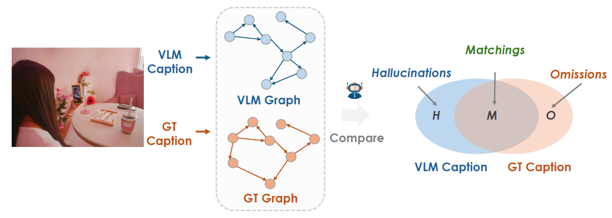

# PerturboLLaVA: Reducing Multimodal Hallucinations with Perturbative Visual Training

[](https://opensource.org/licenses/MIT)
[](https://arxiv.org/pdf/2503.06486)
[](https://github.com/huggingface/transformers)

This repository provides the official PyTorch implementation of the following paper: 
> [**PerturboLLaVA: Reducing Multimodal Hallucinations with Perturbative Visual Training**]() <br>
> [Cong Chen*]()<sup>1,2</sup>, 
> [Mingyu Liu*](https://scholar.google.com/citations?user=FscToE0AAAAJ)<sup>1</sup>, 
> [Chenchen Jing](https://scholar.google.co.jp/citations?user=0TKm3fgAAAAJ/)<sup>3</sup>,
> [Yizhou Zhou](https://scholar.google.com/citations?user=dHBNmSkAAAAJ) <sup>2</sup>,
> [Fengyun Rao](https://scholar.google.com/citations?user=38dACd4AAAAJ/) <sup>2</sup>, 
> [Hao Chen](https://scholar.google.com/citations?user=FaOqRpcAAAAJ)<sup>1</sup>,
> [Bo Zhang](https://bo-zhang.me/)<sup>1</sup>, 
> [Chunhua Shen](https://cshen.github.io/)<sup>1,3</sup>, 
<br>
> <sup>1</sup>Zhejiang University, China, <sup>2</sup>WeChat, Tencent, <sup>3</sup>Zhejiang University of Technology <br>
> *Equal Contribution

## Overview

This paper aims to address the challenge of hallucinations in Multimodal Large Language Models (MLLMs)  particularly for dense image captioning tasks. To address the challenge, we identify the current lack of a metric that finely measures the quality of the caption at the concept level. We hereby introduce HalFscore, a novel metric built upon the language graph that is designed to evaluate both the  accuracy and completeness of dense captions at a
granular level. Additionally, we identify the root cause of hallucination as the model's over-reliance on its language prior. To address this, we propose PerturboLLaVA, which reduces the model's reliance on the language prior by incorporating adversarially perturbed text during training. This method enhances the model's focus on visual inputs, effectively reducing hallucinations and producing accurate, image-grounded descriptions without incurring additional computational overhead.  PerturboLLaVA significantly improves the fidelity of generated captions, outperforming existing approaches in handling multimodal hallucinations and achieving improved performance across general multimodal benchmarks. 

### Hallucination Evaluation
<p align="center"></p>
The diagram of computing HalFscore. We construct the language graph to model both the concepts and their relationships for captions. We can then compare the graphs and identify the hallucinations, omissions and matchings between the two sets of concepts respectively.

### Hallucination Mitigation
<p align="center"></p>
To mitigate the over-reliance on language priors in multimodal models, we introduce a novel training framework that introduces adaptive, context-specific perturbations in the textual inputs during training. This approach simulates the effect of language priors and forces the model to adjust its responses based on visual data rather than textual biases.

## Perturbative Training
Our experiments are conducted based on the settings of LLaVA 1.5, reproduced with [Xtuner](https://github.com/InternLM/xtuner). We focus on the 160k data related to image understanding in [LLaVA 1.5 SFT dataset](https://huggingface.co/datasets/liuhaotian/LLaVA-Instruct-150K/blob/main/llava_v1_5_mix665k.json), using ChatGPT-4 to construct corresponding perturbation texts, which were then inserted into the original conversation data for perturbation training.

The script for the GPT prompt used to construct the perturbation data is `augmentation/gpt_prompt.py`.

In order to explore the impact of the perturbation degree on model training, we design four different methods for inserting perturbation texts, as in `augmentation/combine.py `. For each insertion method, to prevent the model from overfitting to the corresponding pattern, we design multiple system prompts in `augmentation/system_prompts.py` and randomly selected one each time.


## HalF-Score

You can download the images under the dir `PerturboLLaVA/HalFScore/images` from [This Link](https://huggingface.co/datasets/MingyuLiu/PerturboLLaVA_densely_captioned_image_dataset)

Running the following script to get the tuple and compute the final HalFScore.
```python
bash PerturboLLaVA/HalFScore/results/llava/best_150k_final_v3/eval.sh
```

## Acknowledgement 
We based our training and evaluation on these codebases. Thanks for their impressive works!

- [Xtuner](https://github.com/InternLM/xtuner): This is our LLaVA 1.5 reproduction codebase and the codebase for subsequent perturbative training experiments.
- [VLMEval](https://github.com/open-compass/VLMEvalKit/): Our evaluation codebase for MMBench, SEEDBench, and HallusionBench.
- [OPERA](https://github.com/shikiw/OPERA/): Our evaluation codebase for CHAIR.
- [VCD](https://github.com/DAMO-NLP-SG/VCD/): We modified the original VCD code to support beam search.
- [RLAIF-V](https://github.com/RLHF-V/RLAIF-V/)

## BibTeX

```
@article{chen2025perturbollava,
  title={PerturboLLaVA: Reducing Multimodal Hallucinations with Perturbative Visual Training},
  author={Chen, Cong and Liu, Mingyu and Jing, Chenchen and Zhou, Yizhou and Rao, Fengyun and Chen, Hao and Zhang, Bo and Shen, Chunhua},
  journal={arXiv preprint arXiv:2503.06486},
  year={2025}
}
```